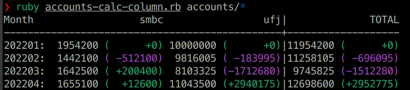
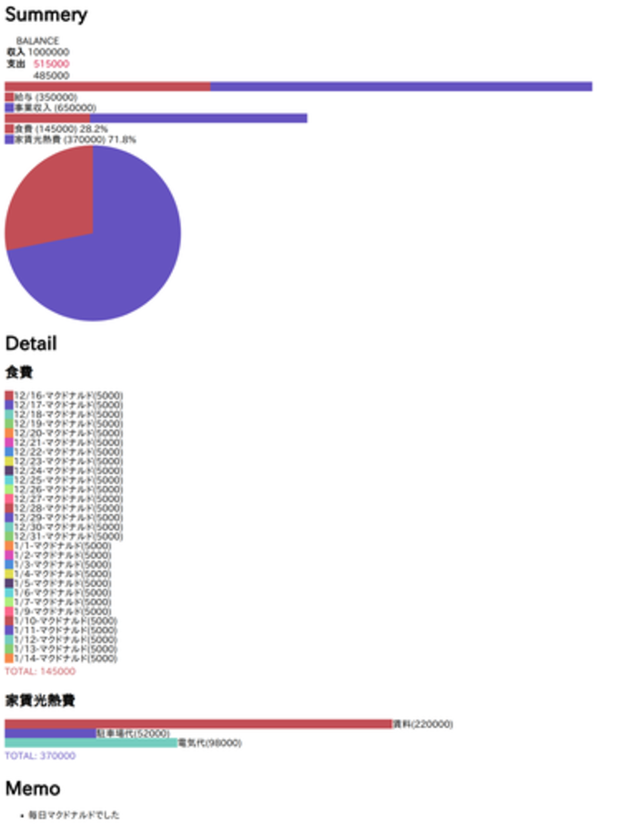
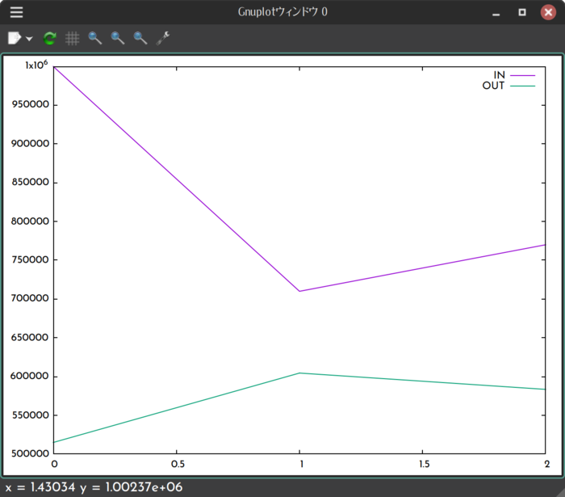
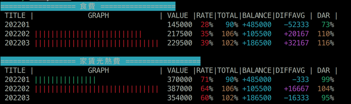

# My Balance Utils

## Synopsis

Excel嫌いの人が収支表(家計簿)をつけるためのコマンドラインユーティリティ集。

## Dependencies

* Ruby
* Gnuplot

## Install

どこか任意の場所に家計簿ディレクトリを作る。
その中に次のようにファイルを配置する。

```
Kakeibo
└ accounts/
  rendered/
  sheet/
  shopping/
  *.rb
  namemap.yaml
```

`sample`ディレクトリの中身と、`utils`ディレクトリの中身を全部コピーすればこのようになるが、空ディレクトリは自ら作成する必要がある。

## Keeping

`sheet`ディレクトリ配下に`sheet-<YYYYMM>.yaml`形式で作成する。

ルートノードは`in`, `out`, `memo`のキーを持つ。

### in

```yaml
{in: {<name>: <value>} }
```

任意の数の収入の項目名`name`と、収入金額`value`からなる。

### out

```yaml
{
  out: {
    <category>: {
      <name>: <value>
    } 
  }
}
```

カテゴリ`category`に分類し、支出項目名`name`と支出金額`value`を任意の数記載する。

`name`は重複できない。

### memo

```yaml
{
  memo: [ <string> ]
}
```

メモ用の文字列の配列である。

## Usage

### Credit Card Converters

```
converter-<card>.rb <csv>
```

クレジットカードのウェブマイページからダウンロードできるCSVからコピペに適したYAMLを生成して出力する。

CSVはMS-CP932のままでソースとする。

|command            |target       |
|-------------------|-------------|
|`converter-epos.rb`|EPOS my Net  |
|`converter-life.rb`|Life web-desk|
|`converter-smbc.rb`|V-Pass       |

請求項目は`namemap.yaml`を参照し、`namemap.yaml`のキーに一致する場合は値に置き換える。

### Account Calc



```
acccount-calc.rb <account-file>...
acccount-calc-column.rb <account-file>...
```

口座変動を表示するためのものである。

アカウントファイルは、年月(`YYYYMM`)と金額をスペース区切りとした行からなる。
あるアカウントに記録のない年月がある場合、口座の残高は`0`として扱われるため注意すること。
また、アカウントファイルは`accounts`ディレクトリ配下に配置されるべきである。

`account-calc.rb`は全口座合計での残高と変動を表示する。

`account-calc-column.rb`は各口座の残高と変動、及び合計を表示する。

### Calc



```
calc.rb <YYYYMM>
```

`sheet`以下のYAMLファイルを分析し、`rendered`ディレクトリ以下にHTMLファイルとして出力する。

### Plot



```
plot.rb in|out|list|plot
```

収支を月ごとに比較する。通常は`list`または`plot`を使う。

`list`は収支を端末上に表示する。
`plot`はGnuplotを用いてグラフにする。

### Analyze



```
analyze.rb <sheet>...
```

引数に渡されたSheetの中での出費カテゴリごとの変動を描画する。
項目はそれぞれ次のような意味になる。

|項目|意味|
|--------|---------------------|
|TITLE|シート名|
|GRAPH|30分割の棒グラフ, 最小の月を0、最大の月を30とする|
|VALUE|カテゴリの合計金額|
|RATE|全出費に対するカテゴリの割合|
|TOTAL|全出費の平均に対する割合|
|BALANCE|収支合計金額|
|DIFFAVG|出費カテゴリの月平均額に対する差額|
|DAR|出費カテゴリの月平均額に対する差の割合|

この機能の使い方はいくつかコツがある。

* 特定の月にしか登場しないような項目を設定するのは避け、変動を比べられるように上手にまとめると良い。どうしても月固有のものは雑費にしたほうが良い
* 特定の月から発生した出費は比べづらいので対象にするシートを限定したほうが良い
* Zshのグロブで`sheet/sheet-<202106-202206>*`のように指定すると絞り込みやすい

### Shopping Calc

```
shopping.rb w|m|Nm|YYYY-MM-DD
```

`shopping/`ディレクトリ配下にあるタブ区切りファイル(ファイル名は任意)を分析し、直近の出費を出力する。

ショッピングファイルは`YYYY/MM/DD 金額 名目 メモ`の4項目である。

`w`は直近1週間, `m`は直近1ヶ月, `Nm`は直近Nヶ月, `YYYY-MM-DD`は指定日以降である。

これは、主に月あたりの自由出費枠がある場合に、既にどれくらいを使ったかをチェックするのに役に立つ――と思ったのだが、手動入力でとてもめんどくさいので作者はもう使っていない。

## Notice

補助通過には対応しておらず、金額は全て整数値であることを期待する。

また、色付けの基準などは作者の収支形態からいって見やすい塩梅なので、うまく機能するかどうかはわからない。